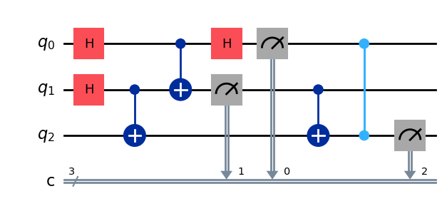

# Quantum Teleportation

## Overview

These scripts demonstrates the quantum teleportation protocol using the Cirq and Qiskit libraries. Quantum teleportation is a process by which the state of a qubit is transferred from one location to another without physically sending the qubit itself. The protocol leverages quantum entanglement and classical communication.

## Requirements

- Python 3.x
- Cirq
- Qiskit
You can install Cirq using pip:

```bash
pip install cirq
pip install qiskit
```

## Code Explanation

The provided script performs quantum teleportation of a qubit's state from Alice (Q1) to Bob (Q3). Here is a step-by-step explanation of the script:

1. **Initialization**:
    - Three qubits are initialized: Q1 (Alice's state qubit), Q2 (Alice's control qubit), and Q3 (Bob's control qubit).

2. **State Preparation**:
    - The state of Q1 is set using a specified quantum gate (`H`, `X`, `Y`, `Z`, or `I`). If an unimplemented gate is provided, an error is raised.

3. **Entanglement**:
    - Q2 and Q3 are entangled using a Hadamard gate on Q2 followed by a CNOT gate between Q2 and Q3.

4. **Bell State Measurement**:
    - A CNOT gate is applied between Q1 and Q2.
    - A Hadamard gate is applied to Q1.
    - Q1 and Q2 are measured.

5. **Conditional Operations**:
    - A CNOT gate is applied between Q2 and Q3.
    - A conditional Z gate is applied to Q3 based on the measurement of Q1.

6. **Final Measurement**:
    - Q3 is measured to obtain the teleported state.

7. **Simulation**:
    - The circuit is simulated for a specified number of repetitions (default is 100).
    - The measurement results are printed.

You can specify the initial state of the qubit to be teleported by modifying the `qubit_to_send_op` parameter. For example:

```python
quantum_teleportation(qubit_to_send_op='X')
```

## Example Output

Here is an example of the circuit and the measurement output:

```
Circuit
(0, 0): ───H───@───H───M───────────────
               │       │
(1, 1): ───H───X───M───@───────────────
                       │
(2, 2): ───@───────────X───@───M('Z')───
           │               │
           X───────────────Z────────────

Measurement output
Counter({0: 50, 1: 50})

Measurement output for qubit 3:
{'0': 47, '1': 53}
```

The output indicates the measurement results of Bob's qubit (Q3), showing the distribution of states after the teleportation process.
